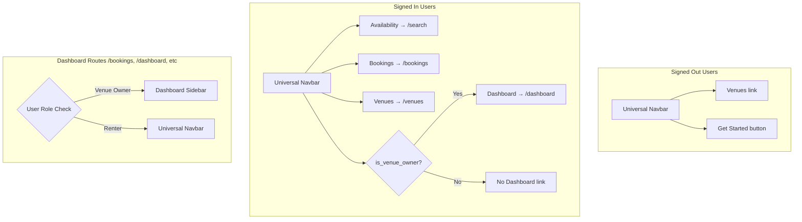

# Navigation System Updates

## Overview

Update the navigation system to provide role-appropriate experiences: renters see the universal navbar everywhere, while venue owners see the dashboard sidebar on dashboard routes.

## Architecture

## Changes

### 1. Universal Navbar - [navigation.tsx](src/components/layout/navigation.tsx)

**For signed-out users:**

- Change "Browse" to "Venues" (still routes to `/venues`)

**For signed-in users:**

- Change "Home" to "Availability" and route to `/search` instead of `/venues`
- Add "Bookings" link routing to `/bookings`
- Add "Venues" link routing to `/venues`
- Only show "Dashboard" link if `user.is_venue_owner` is true

### 2. Dashboard Layout - [(dashboard)/layout.tsx](src/app/\\(dashboard)/layout.tsx)

Make the layout role-aware:

- Use `useCurrentUser` hook to check user role
- If user is a venue owner (`is_venue_owner`): render the current `SidebarNavigation`
- If user is a renter only (not a venue owner): render the universal `Navigation` component instead of the sidebar
- Show a loading state while user role is being determined

### 3. Dashboard Route Protection - [(dashboard)/layout.tsx](src/app/\\(dashboard)/layout.tsx)

Add access control to restrict `/dashboard` to venue owners only:

- When an unauthorized user (not authenticated) or a renter (non-venue owner) tries to access any dashboard route (including `/dashboard`), redirect them to `/bookings`